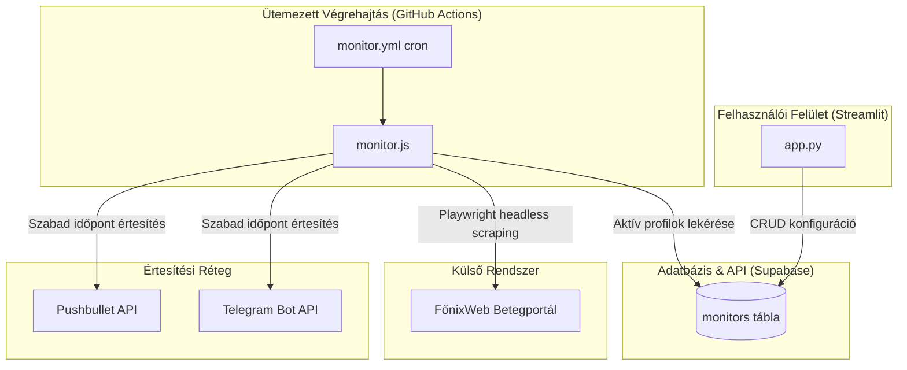

# High-Level Architecture: Fonix Idopont

```mermaid
flowchart TD
    subgraph UI ["Felhasználói Felület (Streamlit)"]
        A[app.py]
    end

    subgraph DB ["Adatbázis & API (Supabase)"]
        B[(monitors tábla)]
    end

    subgraph Runner ["Ütemezett Végrehajtás (GitHub Actions)"]
        C[monitor.yml cron] --> D[monitor.js]
    end

    subgraph Target ["Külső Rendszer"]
        E[FőnixWeb Betegportál]
    end

    subgraph Notifications ["Értesítési Réteg"]
        F[Telegram Bot API]
        G[Pushbullet API]
    end

    A -->|CRUD konfiguráció| B
    D -->|Aktív profilok lekérése| B
    D -->|Playwright headless scraping| E
    D -->|Szabad időpont értesítés| F
    D -->|Szabad időpont értesítés| G
```
